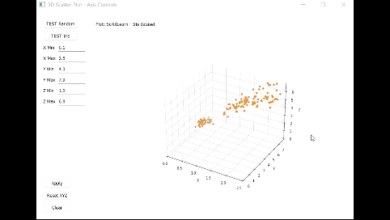

# Interactive 3D scatterplot (GUI)

## 3 dimensional data plotting functionality
version 0.4
folder: /src/

Plotting 3 dimensional (X-Y-Z) data using matplotlib 3D scatter plot. Two datasets are available:
1) **randomized data** in the range of 0-100 in all axis, which varies on each button pressing [Test Random]
2) **iris (flower) dataset** from Python __scikitLearn__ package [Test Iris]
With the help of this (fixed window size) GUI 3 dimansional data can be (scatter) plotted and rearranged 
- by limiting the range along one or all axis,
- by rotating the plot with mouse gestures. 
Load data  
Rotate plot  
Rescale data  

### Key Features:
1)  **Buttons** 
	A) The [Test Random] and [Test Iris] buttons load the corresponding dataset and plot it. 
	Load data  
	B) Apply Button:
	 when clicked, it retrieves the values from the editable fields (see below) and applies them to the plot, updating the axis limits. 
	 No field should remain empty! 
	C) Reset Button: 
	 the axis limits are reset to their optimal values (which are the minimum and maximum of the actual data points along each corresponding axis). 
	 This ensures that all points become visible. Use this button if any plot axis range has been changed previously. 
	D) Clear button: 
	 all loaded data is cleared from the plot. 
2) **Editable fields** 
	Each axis (X, Y, Z) has a pair of fields for the minimum and maximum values to limit the related axis to a certain range. 
	These fields are editable, allowing users to input custom values and consequently exclude some parts of the full dataset from the plot. 
	Push "Apply" button after limits have been modified. 
Rescale data 
3) **Title (Label)** a text indicating the title of the current plot. 

Original idea came from a clustered data plot in which a part of the full dataset should have been shown only and verified from different angles. This is not doable with a simple Matplotlib plot.
    
### Initialization
On startup, the editable fields are filled in with the optimal limits (i.e., the min and max of the loaded data values).

**Calculation of axis limits**: The get_optimal_limits method in the Plot3DWidget class calculates the min and max values for each axis, which are initially populated in the editable fields.

**Dynamic plot updates**: The set_axes_limits method allows dynamic updates to the axis limits based on user input from the editable fields.

**Updating the Title (Label)**:
Whenever plot_random_data or plot_clusters_data is called ("TEST random", "TEST iris" buttons), a (QT Event) signal is emitted that updates the text in the MainWindow label.

**Prerequisites**: Python modules required 
- sys 
- random 
- PyQt5 
- matplotlib, mpl_toolkits 
- numpy 
- sklearn 

### Notes1: Possible functionality developments
- resizable window 
- editable fields value check, user defined number should fall in the min-max range 
- determining clusters for the Iris data using SciKitLearn 
- UX design development (e.g. inactive/active buttons and editable fields)

folder: /fig/
container of figures involved in this Readme

### Notes2: bugfixed Jupyter Notebook - now really interactive
folder: /jupyter_nb/
test file: interactive3Dplot.ipynb
printed (platform independent versions): interactive3Dplot.html and interactive3Dplot.pdf

**@author: Data4every1** 
Created on Thu Sep 5 20:58:00 2024 
Animated gif images created from mp4 https://ezgif.com/