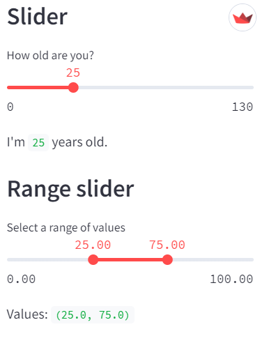
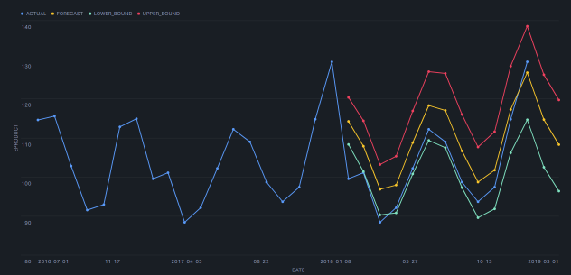

# Snowflake notebooks for data handling

## 1) Dynamic-interactive query with Streamlit module
A simple example of dynamic query parameter changing using a Streamlit interactive slider to set limit value(s) in a Spark Notebook.
 
done: Sept 2024 
## 2) Machine learning - forecast model
Another Spark Notebook example of Machine Learning with Snowflake, using Forecast model.
 
Snowflake folder: [./Snowflake/](./Snowflake/README.md) 
done: Sept 2024 
